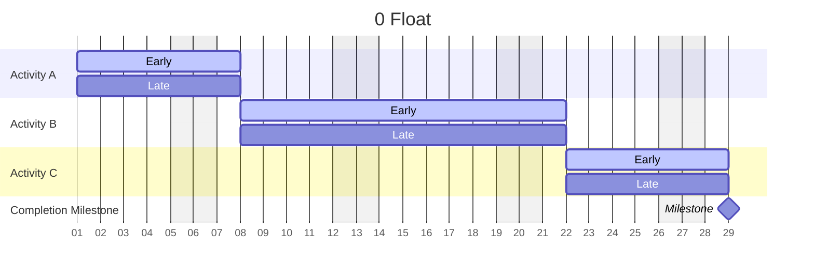

## Dependency Types

One of LeanCPM’s key strengths is its simplicity.  Two types of dependencies — Series and Parallel — make creating schedules easy and powerful.

### Series

Tasks in a series happen one by one. The first must finish before the second can start.

If you’re familiar with legacy CPM, this is a simple Finish-to-Start relationship.

Lag, the desired time between the finish and start, is not supported in series.

### Parallel

Tasks in parallel are worked on simultaneously. However, there is always a leader; the first must start before the second can start, AND the first must finish before the second can finish.

If you’re familiar with legacy CPM, this is a Start-to-Start (SS) AND a Finish-to-Finish relationship.

Lag can be added to the start side of the parallel, but shouldn’t exceed the duration of the first task.

## Dependency Sides

Each Dependency has two sides:

1. The blocker
2. The blocked

> Like Legacy CPM, every task should be a blocker and a blocked.

Dependency sides are like relationships; who we are depends on the subject. For example, I am Ethan’s father, but I am also Mourad’s son. `Hang & Finish Walls` is _blocked by_ `In-Wall Inspection`, but it is also _the blocker of_ `Prime and Paint`.

### The blocker

The blocker, known as the “predecessor” in legacy CPM, is the task that must finish before the task being blocked can start, in series.

In parallel, the blocker must start before the task can start, AND finish before the task can finish.

### The blocked

The blocked task, known as the “successor” in legacy CPM, is the one that is being blocked.

In a series, the blocked task cannot start until the blocker finishes.

In parallel, the blocked can’t start until the blocker starts, AND it cannot finish until the task finishes.

## Dependency Path

A string of tasks, issues, and milestones connected by dependencies.

#### Valid Dependency path

Where a task has both:

1. A path of blockers that eventually leads to an actual start, cleared blocker, issue, or milestone
2. A path of blocked items (successors) that eventually leads to a milestone

## Cleared Blockers

These tasks with a `Finished` or `Completed` status, Issues with a `Cleared` status, or Milestones with a `Done` status, were once blocking the subject task.

If all blockers of a task are cleared, then the task’s Target dates are locked.

## Driving vs Non-driving

A driving dependency is one that, if removed, would either:

1. Change the Free Float of the task or
2. Change the Total Float of the task

## FAQ

How do I show concrete curing? I usually use an FS+lag, but now I can’t? You can! We recommend adding an extra day for curing in your `Pour and Finish` Task and renaming it to `Pour, Finish, Cure`.